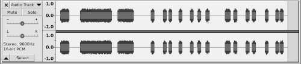
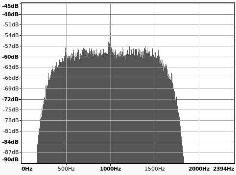
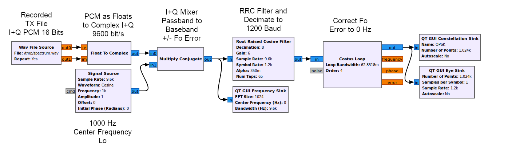

#### A 10 Meter 1200 Baud PSK IP Node
Based on the Dire Wolf repository, it removes all the APRS, Repeaters, Beacons, FSK, and AFSK. The intent is to create a Linux based microcontroller with GPIO Push-To-Talk (PTT) Packet Radio Node transmitting QPSK. Currently set for 1200 Baud/2400 bit/s at 9600 sampling rate. It uses a Root-Raised-Cosine (RRC) matched filter on transmit and receive, and a slightly modified ```Improved L2 Protocol``` (IL2P).

Designed for Internet Protocol (IP) use on 10 meters, which has a regulatory limit of 1200 Baud, and must operate in the **28.120 - 28.189 MHz** band if automatically controlled. In theory you could input your PSK into an FM modulator, but you would have to limit the modulation Index to less than 1 radian on 10 Meters (deviation equal to the highest modulating frequency), or about 1.6 kHz deviation on HF. VHF and UHF don't have modulation index limits, and have higher symbol rate and bandwidth allowances. Which is why most Amateurs use FSK on HF.

The center frequency of ```1000 Hz``` was chosen to keep the signal in the audio bandpass of most radios. You could move this higher to about ```1600 Hz```, but this is the limit for most radios.

The use of digipeaters in the AX.25 protocol was a terrible design, and have been removed from this software. The functionality of a repeater should use full-duplex (or cross-band) techniques, so there are no hidden stations.

The Improved Level 2 Protocol (IL2P) was built upon AX.25 Version 2.0, thus a lot of the Version 2.2 functionality is not used in this protocol. The protocol was modified to be hard-wired using only the maximum FEC and Header Type 1, as it is the most useful. It is designed here to transport Level 3 Internet Protocol (IP). There is some Broadcast functionality left, used for ARP, Node Identification, and multicast UDP. The KISS commands from the kernel are limited to sending data, and other command types are not processed.

The modem uses the ALSA Linux Soundcard 16-bit stereo channel PCM, at a fixed 9.6 kHz sample rate. The network interface uses a Linux pseudo-terminal running the KISS protocol. This interfaces to the AX.25 Level 3 networking using the ```kissattach``` program, making the modem routable over IP.
#### Status
Ubuntu desktop is used for development. The PTT code is currently commented out to prevent core dumps, as the desktop doesn't have the GPIO, but the idea is to run this on a Linux microcontroller when fully developed. The receive EOF logic is not well thought out.

The GPIO will have PTT, DCD, Connect, and Sync as interface lines.

The demod.c file is under development. The Timing Estimation (TED) needs development.
#### Notes
The IL2P description says the idle symbols are supposed to be alternating ```0101``` binary during ```txdelay``` and ```txtail``` but this doesn't work for PSK, so we send '00' and '11' for QPSK. This results in a BPSK signal 1000 Hz center frequency.

```
+----------------------+-------------+---------------------+
| txdelay idle symbols | IL2P packet | txtail idle symbols |
+----------------------+-------------+---------------------+
   ramp-up transmitter     payload    ramp-down transmitter
```
What the audio looks and sounds like. This shows a series of pings, with no station answering, and the beginning is extranoues output from the chrome browser over UDP:   

   

[Link to a recorded audio WAV file](docs/qpsk-1200-baud-9600-samplerate.wav)  

This has an exagerated ```txdelay``` and ```txtail``` which is the 1 kHz beeps you hear.

What the spectrum looks like:   

   

This looks like about 1 kHz +/- 800 Hz or 1600 Hz bandwidth, so the **emission** symbol would be **1K60J2D**.
#### Startup
The ```ipnode``` program runs in a loop with three threads (tx, rx, and kiss). It will read the config file ```ipnode.conf``` if available, and begin running.
```
$ ipnode -h

usage: ipnode [options]

  --help    Print this message

```

Using ax25-tools and ```kissattach``` command seems to work well as the pseudo-terminal kiss interface.

Example:

Create the ```/etc/ax25/axports``` file:
```
#
# The format of this file is:
# name callsign speed paclen window description
#
ip192 W1AW-10 0	256 7	ip192 port (1200 Baud QPSK)
```

Execute like:
```
$ ipnode >>ipnode.log & 
Audio device for both receive and transmit: default
Created symlink /tmp/kisstnc -> /dev/pts/2
Virtual KISS TNC is available on /dev/pts/2

$ sudo kissattach $(ls -l /tmp/kisstnc | awk '{print $NF}') ip192 44.190.100.1
```
You should see a new interface called ```ax0``` which should look something like this:
```
ax0: flags=67<UP,BROADCAST,RUNNING>  mtu 255
        inet 44.190.100.1  netmask 255.0.0.0  broadcast 44.255.255.255
        ax25 W1AW-10  txqueuelen 10  (AMPR AX.25)
        RX packets 0  bytes 0 (0.0 B)
        RX errors 0  dropped 0  overruns 0  frame 0
        TX packets 12  bytes 1518 (1.5 KB)
        TX errors 0  dropped 0 overruns 0  carrier 0  collisions 0
```
A routing table might look like this:
```
$ route -4
Kernel IP routing table
Destination     Gateway         Genmask         Flags Metric Ref    Use Iface
default         router          0.0.0.0         UG    600    0        0 wlp0s20f3
44.0.0.0        0.0.0.0         255.0.0.0       U     0      0        0 ax0
link-local      0.0.0.0         255.255.0.0     U     1000   0        0 wlp0s20f3
192.168.1.0     0.0.0.0         255.255.255.0   U     600    0        0 wlp0s20f3
```
When you are done, or you want to restart, you can delete the kissattach using:
```
sudo pkill -f "kissattach"
```
You can use ```wireshark``` to view the ```ax0``` interface.
```
Frame 1: 216 bytes on wire (1728 bits), 216 bytes captured (1728 bits)
KISS: Data frame, Port 0
    .... 0000 = Cmd: Data frame (0)
    0000 .... = Port: 0
AX.25, Src: W1AW-10, Dst: QST, Ver: V?.?
    Destination: QST
    Source: W1AW-10
    Control field: U, func=UI (0x03)
    Protocol ID: IP (0xcc)
Internet Protocol Version 4, Src: 44.190.100.1, Dst: 239.255.255.250
User Datagram Protocol, Src Port: 34392, Dst Port: 1900
Simple Service Discovery Protocol
```
#### FCC Enabling USA Regulations
##### § 97.115 Third party communications.
(c) No station may transmit third party communications while being automatically controlled ***except a station transmitting a data emission***.   
(d) At the end of an exchange of international third party communications, the station must also transmit in the station identification procedure the call sign of the station with which a third party message was exchanged.   
##### § 97.221 Automatically controlled digital station.   
(b) A station may be automatically controlled while transmitting a data emission on the ***28.120-28.189 MHz*** segment.   
##### § 97.307 Emission standards.
(f)(4) Only a data emission using a ```specified``` digital code may be transmitted. The symbol rate must not exceed ***1200 bauds***, or for ```frequency-shift keying```, the frequency shift between mark and space must not exceed 1 kHz. (not applicable for PSK)   
##### § 97.309 RTTY and data emission codes.
(b) A station may also transmit a data emission using an ***unspecified*** digital code, except to a station in a country with which the United States does not have an agreement permitting the code to be used.   

#### GNU Radio Experiments
I threw together the receiver design I have so far:   

